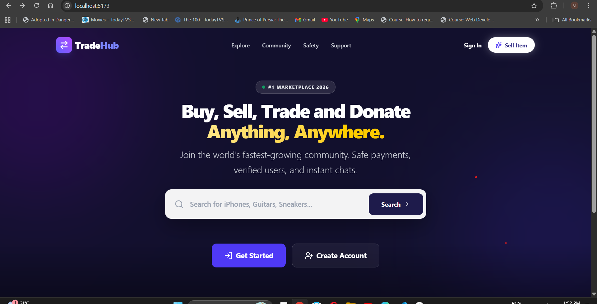
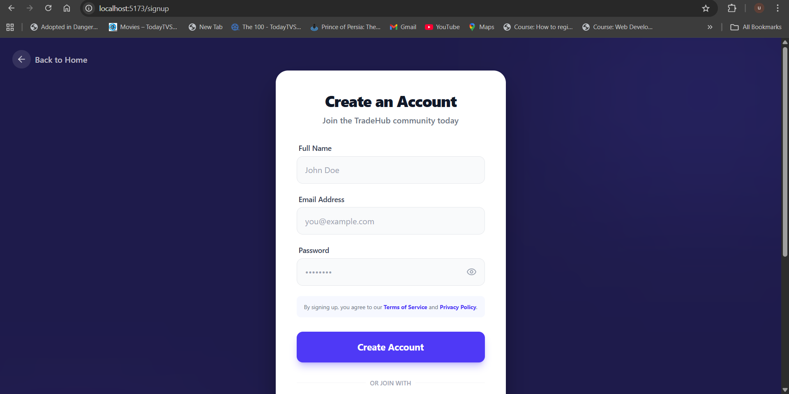
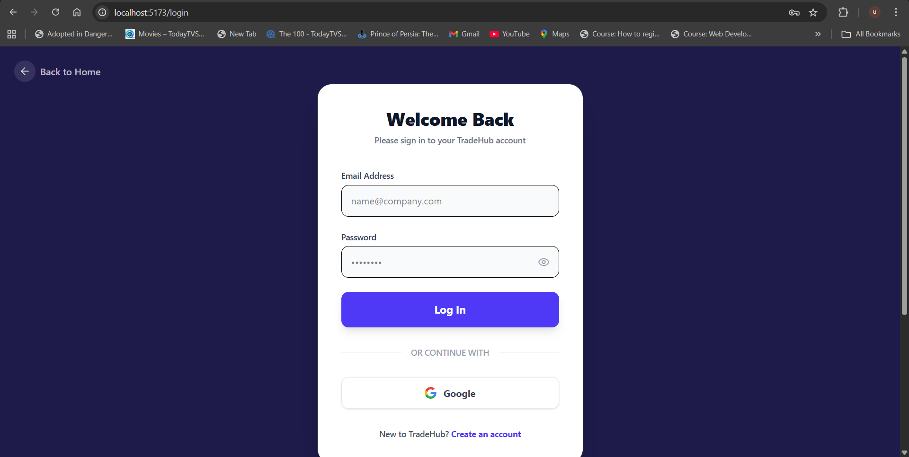
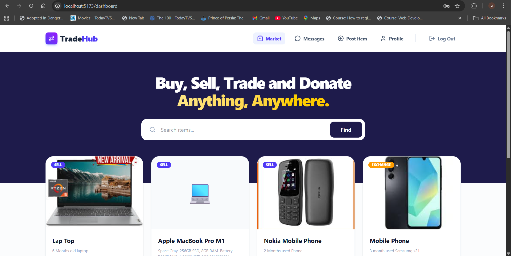
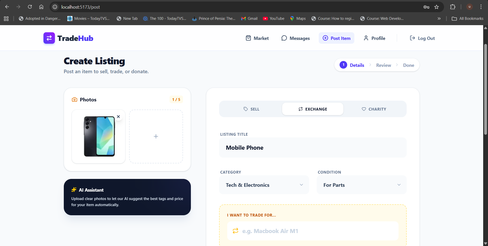
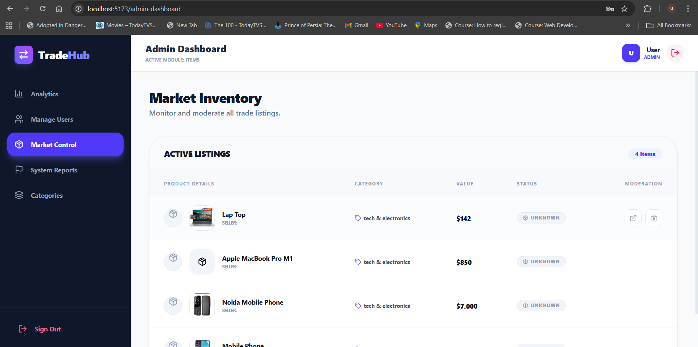

# 🌐 TradeHub – Item-to-Item Selling & Trading Platform


| Student Name | Ushan Gimhan      |
| ------------ | ----------------- |
| Batch        | GDSE 71           |
| Project      | RAD Final Project |

---

## 📑 Table of Contents

* [Project Title](#-project-title)
* [Overview](#-overview)
* [Learning Outcomes](#-learning-outcomes)
* [System Description](#-system-description)
* [Key Features](#-key-features)
* [System Architecture](#-system-architecture)
* [Technology Stack](#-technology-stack)
* [Project Structure](#-project-structure)
* [Screenshots](#-screenshots)
* [Setup & Installation](#-setup--installation)
* [Future Enhancements](#-future-enhancements)
* [License](#-license)
* [Contact](#-contact)

---

## 📌 Project Title

### **TradeHub – Item-to-Item Selling & Trading Platform**

---

## 📖 Overview

**TradeHub** is a **full-stack MERN + TypeScript marketplace platform** that enables users to **sell, buy, exchange, and donate items** through a modern, real-time web application.

Unlike traditional e-commerce systems, TradeHub focuses on **item-to-item trading**, allowing users to negotiate and complete trades directly through an integrated **real-time chat system**.

The project is developed following the **Rapid Application Development (RAD)** methodology, emphasizing:

* Iterative development
* Prototyping
* Continuous user feedback
* Feature-driven enhancements

---

## 🎯 Learning Outcomes

This project demonstrates proficiency in:

* MERN Stack full-stack development
* TypeScript for scalable frontend & backend code
* RESTful API design & integration
* Authentication & Authorization (JWT)
* Role-based access control
* Real-time communication using Socket.IO
* State management with React Context / Redux
* Responsive UI with Tailwind CSS
* AI feature integration using OpenAI API
* Deployment using cloud platforms
* Git & GitHub version control best practices

---

## 🧠 System Description

TradeHub enables users to:

### ✔ Sell Items

* Upload item details
* Set price, condition, images, and category
* Manage listings from the user dashboard

### ✔ Buy Items

* Browse items
* Contact sellers directly
* Negotiate price via chat

### ✔ Trade Items (Core Feature)

* Request item-to-item exchanges
* Offer owned items for trade
* Accept or decline trade offers
* Negotiate terms via real-time chat

### ✔ Charity Mode

* Donate items to other users
* Community-based sharing model

---

## ✨ Key Features

### 👤 User Features

* Secure authentication (JWT)
* Create & manage item listings
* Buy, sell, exchange, or donate items
* Real-time chat with sellers/buyers
* Item search & filtering
* Profile & dashboard management

### 🤖 AI-Powered Features

* AI price suggestion for items
* AI-generated item descriptions
* AI fraud & fake item detection
* AI smart trade recommendations
* Personalized recommendation feed

### 🛠 Admin Features

* User management
* Item moderation
* Fake item detection
* Category management
* Platform analytics & reports

---

## 🏗 System Architecture

### 🔹 Architecture Style

**Client–Server Architecture**

### 🔹 Frontend

* React + TypeScript
* Tailwind CSS
* Socket.IO client
* Vite build system

### 🔹 Backend

* Node.js + Express (TypeScript)
* MongoDB Atlas
* Mongoose ODM
* JWT Authentication
* Socket.IO server

### 🔹 Deployment

* Frontend → Vercel
* Backend → Render
* Database → MongoDB Atlas

---

## 🛠 Technology Stack

### 🔹 Frontend

* React
* TypeScript
* Tailwind CSS
* Axios
* Socket.IO Client
* Vite

### 🔹 Backend

* Node.js
* Express.js
* TypeScript
* MongoDB + Mongoose
* JWT
* Socket.IO

### 🔹 AI Integration

* OpenAI API

### 🔹 Tools

* VS Code
* Postman
* Git & GitHub
* MongoDB Compass

---

## 🗂 Project Structure

### 📁 Frontend (`SWAPSPOT_FE`)

```text
src/
├── assets/
├── components/
├── context/
├── pages/
├── routes/
├── services/
├── App.tsx
├── main.tsx
├── index.css
```

### 📁 Backend

```text
src/
├── controllers/
├── routes/
├── models/
├── middleware/
├── services/
├── utils/
├── server.ts
```

---

## 📸 Screenshots

> (Add screenshots here)

## 📸 Screenshots

### 🏠 Home Page


### Sign Up Page


### LogIn Page


### 👤 User Dashboard


### 📦 Item Listing Page


### 💬 Item Details & Chat


### 🛠 Admin Dashboard



---

## 🚀 Setup & Installation

### 🔹 Prerequisites

* Node.js 18+
* MongoDB Atlas account
* Git
* VS Code

---

### 🔹 Backend Setup

```bash
git clone https://github.com/ushan-Gimhan/SWAPSPOT_BE.git
cd backend
npm install
npm run dev
```

Create `.env` file:

```env
PORT=5000
MONGO_URI=your_mongodb_uri
JWT_SECRET=your_secret
OPENAI_API_KEY=your_key
```

---

### 🔹 Frontend Setup

```bash
git clone https://github.com/ushan-Gimhan/SWAPSPOT_FE.git
cd SWAPSPOT_FE
npm install
npm run dev
```

---

## 🔮 Future Enhancements

* 📱 Mobile App (React Native)
* 🔔 Push Notifications
* 💳 Payment Gateway Integration
* 🌍 Multi-language Support
* 📊 Advanced Analytics Dashboard
* 🧠 Smarter AI Trade Matching

---

## 📜 License

This project is licensed under the **MIT License**.

---

## 📧 Contact

**Ushan Gimhan**
📩 Email: [ushangimhan@gmail.com](mailto:ushangimhan@gmail.com)
🔗 GitHub: [https://github.com/ushan-Gimhan](https://github.com/ushan-Gimhan)

---
